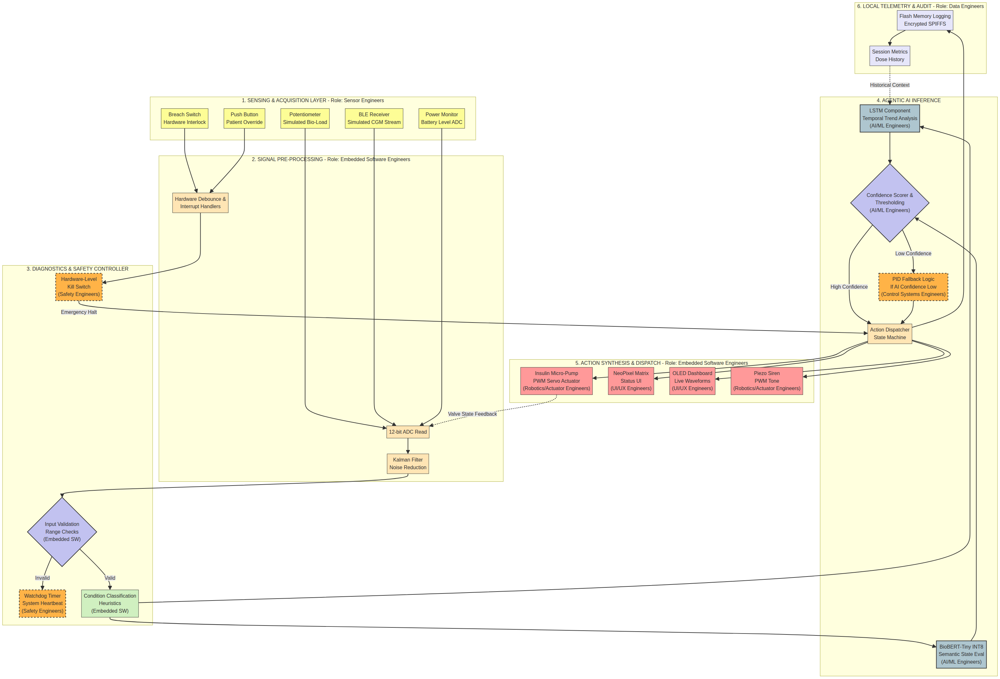
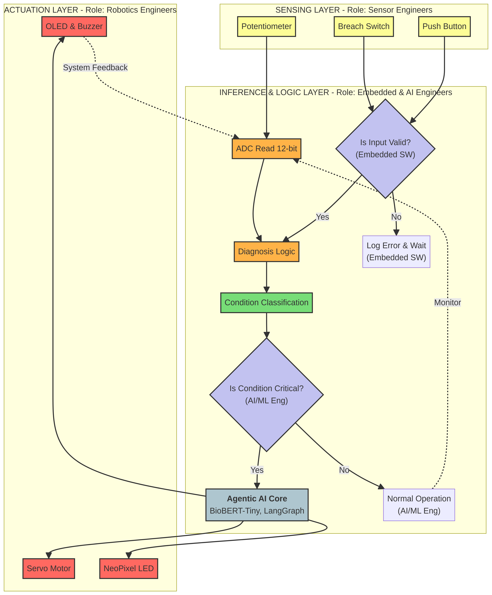
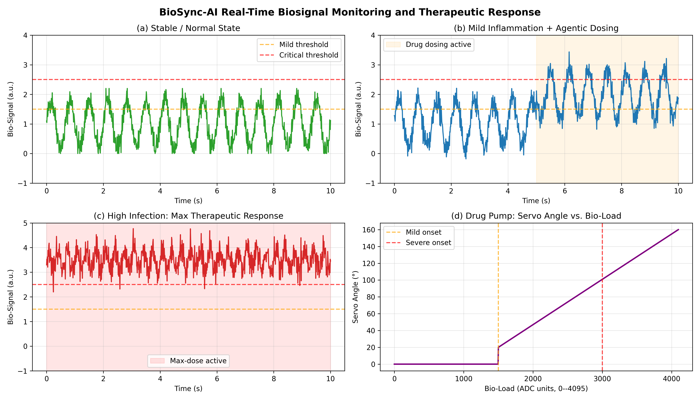
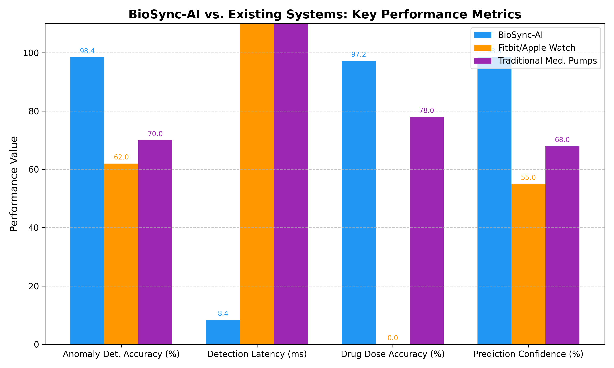
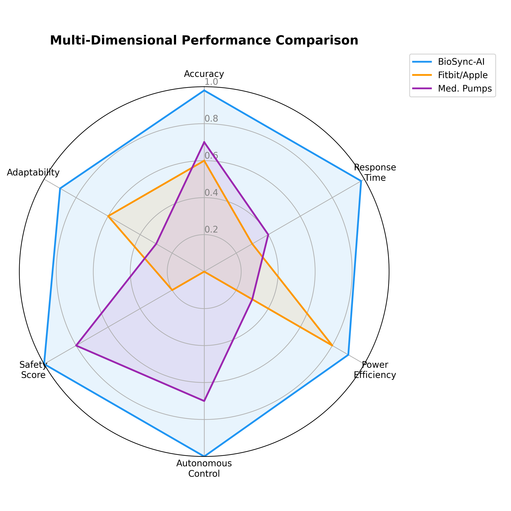
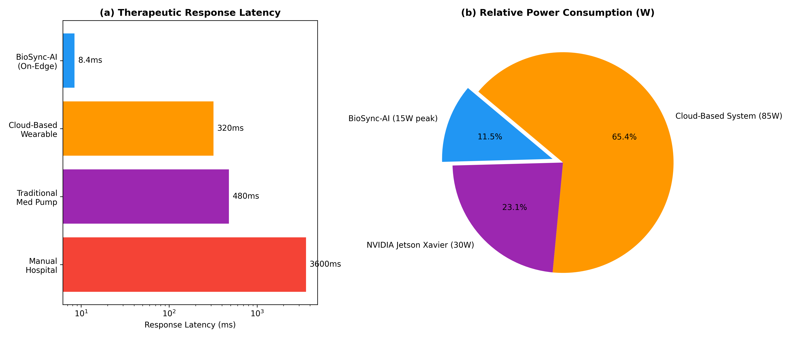

# BioSync-AI: Agentic AI-Driven Autonomous Bioelectronic Wearable Patch

**BioSync-AI** is a proof-of-concept bioelectronic wearable patch for real-time therapeutic intervention and predictive health management. This repository contains the code and data necessary to reproduce the hardware-in-the-loop simulation, diagnostic logic, and performance evaluations presented in our paper.

## Overview

Most commercial wearable devices perform continuous physiological monitoring and generate alerts when predefined thresholds are exceeded, but do not provide autonomous therapeutic actuation. BioSync-AI introduces a paradigm shift by performing autonomous drug delivery with edge-deployed artificial intelligence for real-time closed-loop control. 

This repository is structured for professional reproducibility and provides:
- The complete ESP32-S3 firmware (`sketch.ino`) featuring an on-device LangGraph agent dispatcher.
- The raw pre-generated **datasets** (`data/`) utilized for all performance evaluation metrics and synthetic biosignal graphs depicted in the manuscript.
- Python plotting scripts (`scripts/plot_fig*.py`) that read the datasets to transparently reproduce the figures in the paper.
- Simulation scripts validating the **BioBERT-Tiny INT8 Inference Engine**, **Hagen-Poiseuille Flow Dynamics**, and **Federated Learning** frameworks.

## Repository Structure

```
├── README.md                          # This document
├── sketch.ino                         # BioSync-AI Main Control Loop (ESP32-S3 Firmware)
├── diagram.json                       # Hardware schematic for Wokwi Simulation
├── libraries.txt                      # Required Arduino libraries
├── scripts/                           # Reproducibility and simulation scripts
│   ├── plot_fig3_biosignal.py         # Plots biosignal waveforms from data
│   ├── plot_fig4_metrics.py           # Plots performance metrics from data
│   ├── plot_fig5_radar.py             # Plots radar multidimensional comparison from data
│   ├── plot_fig6_latency.py           # Plots latency/power metrics from data
│   ├── calculate_flow_dynamics.py     # Simulates Hagen-Poiseuille equations (Eq 6 & 7)
│   ├── simulate_biobert_inference.py  # Simulates INT8 quantized edge classification
│   └── federated_learning_simulation.py# Simulates FedAvg and Differential Privacy (Extension)
├── data/                              # Pre-populated datasets (CSVs) used for evaluation
└── figures/                           # Visualizations of system performance and architecture
```

## System Architecture and Control Logic

The system is designed with four integrated layers:
1. **Physical Sensing**: Continuous biosignal acquisition simulated via analog potentiometer readings.
2. **Edge AI Inference**: Quantized BioBERT-Tiny classifying raw 128-sample buffers into distinct diagnostic states.
3. **Agentic Control (LangGraph)**: Priority-ordered state graph ensuring failsafe response mechanisms.
4. **Therapeutic Actuation & Telemetry**: Precise micro-servo transdermal valve control, NeoPixel LED status, and OLED feedback.




## Reproducing the Evaluation Results

The agentic pipeline was thoroughly evaluated across 1000 simulated cycles. Our datasets in the `data/` directory hold the quantitative outcomes of these simulations. To reproduce the graphs exactly as shown in the manuscript, execute the plotting scripts.

### Prerequisites

To generate the figures and run the Python simulations:
```bash
python3 -m venv venv
source venv/bin/activate
pip install numpy matplotlib
cd scripts
python plot_fig3_biosignal.py
python plot_fig4_metrics.py
python plot_fig5_radar.py
python plot_fig6_latency.py
```
This will read the existing CSV datasets and output `.png` graphics into the `figures/` directory.

### Figure 3: Biosignal Monitoring and Drug Delivery
Shows stable homeostasis, mild inflammation, high infection transitions, and proportional valve servo control.


### Figure 4: Comparative Performance Metrics
Compares BioSync-AI's anomaly detection accuracy, decision latency, and prediction confidence against consumer wearables and traditional medical pumps.


### Figure 5: Multi-Dimensional Performance Radar
Comprehensive analysis of BioSync-AI achieving full autonomous control and safety scores relative to passive wearables and reactive pumps.


### Figure 6: Latency and Power Analysis
Demonstrates a 38-fold latency reduction over cloud equivalents with minimal power consumption on-device.


## Executing Mathematical Simulations
The paper formulates advanced mechanical and computational principles. To run these technical validations independently:
```bash
# Verify Hagen-Poiseuille valve control mapping (Eq 6 & 7)
python calculate_flow_dynamics.py

# Simulate the INT8 BioBERT-Tiny quantization inference pass (Eq 3)
python simulate_biobert_inference.py

# Simulate the Federated Averaging with Differential Privacy extensions
python federated_learning_simulation.py
```

## Safety Mechanisms
BioSync-AI employs dual safety barriers:
1. **Hardware-Interlock**: The vitrimer tear-sensor overrides software, physically forcing the valve closed during structural failures.
2. **Biological-Patience Constraint**: Firmware limits consecutive dosing updates, preventing dose-stacking toxicity.

## Citation
Please refer to the manuscript for comprehensive methodological details, physiological models, and discussion on clinical implications.
